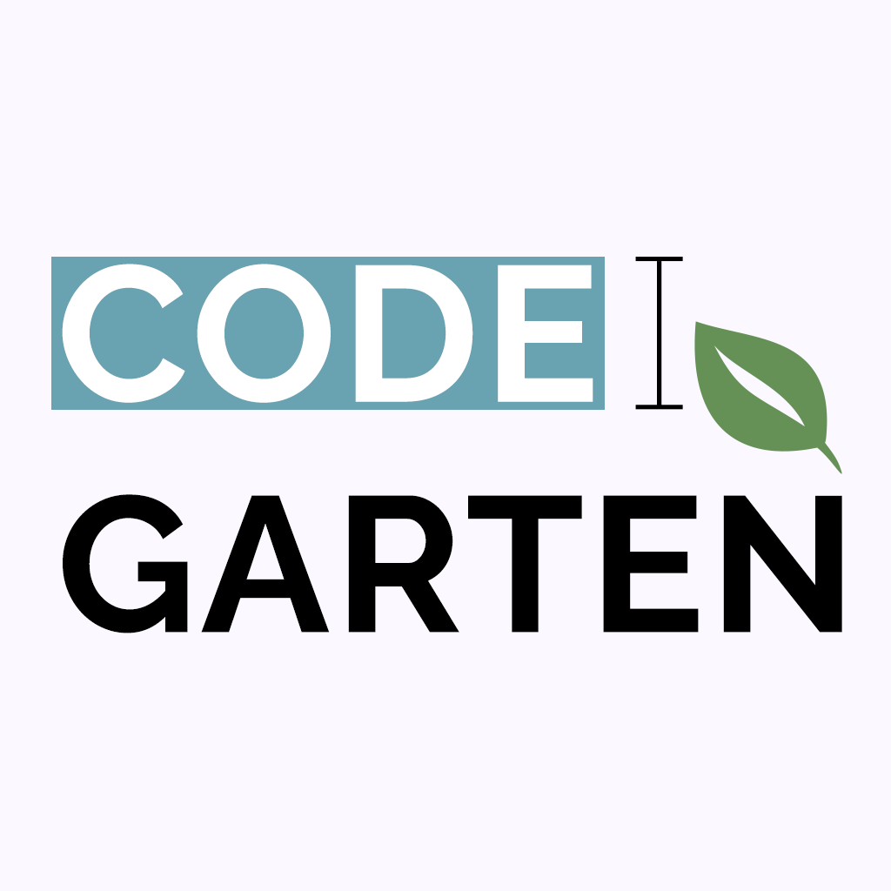

<div align="center" style="margin-bottom: 30px;">
    <div style="margin-bottom: 30px">
        
    </div>
    <div>
        <a href="/LICENSE">
            
        </a>
        <a href="../../graphs/contributors">
            
        </a>
        <a href="../../stargazers">
            
        </a>
        <a href="../../issues">
            
        </a>
        <a href="../../pulls">
            
        </a>
    </div>
</div>

# Overview
The i-on initiative seeks to build an extensible platform in order to support academic activities. The i-on CodeGarten project provides a system for both students and teachers that aims to help with the management of GitHub repositories, in an academic context.

# Table Of Contents
- [Functionalities](#functionalities)
- [Components](#components)
- [Quick Start With Docker](#quick-start-with-docker)
- [Getting Started](#getting-started)
    - [Running the server application](#running-the-server-application)
        - [Creating a GitHub App](#creating-a-github-app)
        - [Setting up the secrets](#setting-up-the-secrets)
            - [Cipher key](#cipher-key)
            - [GitHub App private key](#github-app-private-key)
            - [GitHub App properties JSON](#github-app-properties-json)
        - [Warning to Windows users](#warning-to-windows-users)
        - [Running with Docker](#running-with-docker)
        - [Building the server application](#building-the-server-application)
        - [Running without Docker](#running-without-docker)
    - [Running the web application](#running-the-web-application)
        - [Registering the client](#registering-the-client)
        - [Setting up the environment variables](#setting-up-the-environment-variables)
        - [Setting up the cipher key](#setting-up-the-cipher-key)
        - [Running with Docker](#running-with-docker-1)
        - [Building the web application](#building-the-server-application)
        - [Running without Docker](#running-without-docker-1)

# Functionalities
i-on CodeGarten exposes the following functionalities:

- Authentication through a GitHub account
- Listing of the user's GitHub Organizations
- Classroom creation and listing in a GitHub Organization
- Student and team management in a classroom
- Assignment management in a classroom
- Deliveries management in an assignment
- Automatic creation of GitHub repositories by joining an assignment
- Student delivery checking by teachers
- Invite support for both classrooms and assignments

# Components
The i-on CodeGarten system is composed by a server application and a web application, which serves as a client for the server app.

The i-on CodeGarten server application is an application that exposes an web API. All i-on CodeGarten clients (web, mobile...) communicate with this server application. It is also here where all the system logic is implemented and where the system information is stored. This application is also responsible for performing all communication with the web API provided by GitHub, through the use of a GitHub App.

The CodeGarten web application uses the API to expose its functionalities to the user in a friendly manner, acting as a client of the server application.

# Quick Start With Docker
To execute both the web app, the server app and the database:
- Set up [these](#setting-up-the-secrets) environment variables in the `env_server` file in the `.docker` directory
- Set up these environment variables in the `env_web` file in the `.docker` directory (more information [here](#setting-up-the-environment-variables)):
    - `CG_CLIENT_ID`
    - `CG_CLIENT_SECRET`
    - `CG_WEB_CIPHER_KEY`
- Execute the following command:
```sh
docker-compose -f .docker/docker-compose.yml up
```
- The web application should now be available on port `80` and the server application on port `8080`

The created containers can be cleaned up by executing the following command:
```sh
docker-compose -f .docker/docker-compose.yml down
```

# Getting Started
The following sections document the requires procedures to run the i-on CodeGarten system.

## Running the server application
There's different ways to run the server application, although both of them require the `secrets` directory to be set up (in the case of Docker, in `code/jvm`), as well as the creation of a GitHub App.

### Creating a GitHub App
In order for the server application to be able to make requests to the GitHub API, it needs a GitHub App. To do so, follow the instructions detailed [here](https://docs.github.com/en/developers/apps/building-github-apps/creating-a-github-app). Then, set up these options accordingly:

- Callback URL: This should be set to the `/im/github/authorize/cb` path relative to the server app's domain (e.g. `http://localhost:8080/im/github/authorize/cb`)
- Setup URL: This should be set to the `im/github/install/cb` path relative to the server app's domain (e.g. `http://localhost:8080/im/github/install/cb`)
- Permissions: Please set the following permissions:
    - Repository Permissions
        - Administration (Read & Write)
        - Contents (Read & Write)
        - Metadata (Read-only)
        - Commit Statuses (Read-only)
    - Organization permissions
        - Members (Read & Write)
        - Administration (Read & Write)
- Disable "User-to-server token expiration"

### Setting up the secrets
The server application requires some secret information in order to be able to be executed (including running the tests). This information is composed by:

- A cipher key that'll be used to cipher sensitive information in the database
- The GitHub App's private key, in order to be able to sign JWTs
- A GitHub App Properties JSON that specifies information about the Github App

This information can be specified through the use of the following environment variables, respectively:

- `CODEGARTEN_CIPHER_KEY`
- `CODEGARTEN_GITHUB_APP_PRIVATE_KEY`
- `CODEGARTEN_GITHUB_APP_PROPERTIES`

More information about the value of these variables in the following sections.

#### Cipher key
The cipher key is specified in the `CODEGARTEN_CIPHER_KEY` environment variable. It will be padded or cut in order to have exactly 16, 24 or 32 bytes.

#### GitHub App private key
The GitHub App's private key can be obtained from its configuration page. In order for the server application to read it properly, the text present in the `.pem` file needs to be encoded in Base64 and placed in the `CODEGARTEN_GITHUB_APP_PRIVATE_KEY` environment variable.

#### GitHub App properties JSON
This information needs to follow the following scheme:
```json
{
    "name": "GitHub App Name",
    "id": 1234,
    "clientId": "The Client ID",
    "clientSecret": "The Client Secret"
}
```
- name: The GitHub App's client name
- id: The GitHub App's "App ID"
- clientId: The GitHub App's "Client ID"
- clientSecret: The GitHub App's "Client Secret"

This information can be obtained through the GitHub App's configuration page. The client secret can be obtained by generating one in that same page.

In order for the server application to read this information, the JSON content needs to be encoded into Base64 and placed in the `CODEGARTEN_GITHUB_APP_PROPERTIES` environment variable.

### Warning to Windows users
Since Windows uses CRLF (carriage-return line-feed) line endings, there may be problems while trying to run and build the server application.

In order to fix these issues, the `Checkout as-is, commit Unix-style line endings` option must be enabled during the Git installation process. This guarantees that every file is converted to LF line endings once committed, and that checkouts don't result in line-ending conversions, keeping them as LF. In case of having Git already installed, the `core.autocrlf` configuration key can be changed as shown below:

```
git config --global core.autocrlf input
```

### Running with Docker

To run the i-on CodeGarten server app locally with Docker, the `env_server` file in the `.docker` directory needs to contain the environment variables detailed [here](#setting-up-the-secrets).

After setting up the environment file, the server app can be executed using the `docker-compose.yml` Docker Compose file present in the `.docker` directory:

```sh
# Build (without tests) and extract uber jar in order to build the docker image (invert '/' if using Windows)
code/jvm/gradlew -p code/jvm extractUberJar -x test

# Run the server and both the database and test database on three containers
docker-compose -f .docker/docker-compose.yml up codegarten-server
```

After running this command, the server application should be available on port `8080` (can be changed through the `PORT` environment variable and port mapping option in the compose file) and the database on port `5432`. The connection string for the database can also be changed, as seen in the `JDBC_DATABASE_URL` environment variable defined in the docker compose file.

In order to access the API, an access token is required. More info about how to obtain one is available [here](/docs/api/auth/README.md).

To clean up the application and database containers, Docker Compose can be used again:

```sh
# Remove docker images and clean resources
docker-compose -f .docker/docker-compose.yml down
```

### Building the server application
The server application will connect to a PostgreSQL database specified with the `JDBC_DATABASE_URL` environment variable. The database URI can also be specified using `DATABASE_URL` environment variable, although it needs to be formatted as specified [here](https://www.postgresql.org/docs/current/libpq-connect.html#LIBPQ-CONNSTRING). The test database also needs to be specified using the `CODEGARTEN_TEST_DB_CONNECTION_STRING` environment variable, as well as the [secrets](#setting-up-the-secrets)

The execution of this command in the `code/jvm` directory will build the application.

```
gradlew build
```

The above command will attempt to start a test database using Docker on port `5433`. If that's not the desired behavior, the following command can be executed instead.

```
gradlew build -x dbTestsWait -x dbTestsDown
```

### Running without Docker
The previous section explained how to build the server application. Running the server app requires the database to be specified using the environment variables stated [here](#building-the-server-application), as well as the [secrets](#setting-up-the-secrets). The database must be initialized using the SQL scripts provided [here](../../tree/main/code/sql)

To run the built application, the following command can be executed in the `code/jvm` directory:
```
java -server -jar ./build/libs/codegarten-0.1.jar
```

## Running the web application
The web application can be executed in multiple ways, described in the following sections.

### Registering the client
The web application needs to be a registered client in the server application's database. In order to register it, the CLIENT table needs to have a row dedicated to it. For this, the following information is required:

- Client Name: A name for the client (e.g. `Web App`)
- Client Secret: A secret that will be used by the client when obtaining user access tokens. This must be hashed using the SHA-256 hash function. (e.g. `change me` -> `64ba009cceac4ab8b3c877ae1b6b010e8fc5a15ab567238e3a6107cd4dfe147d`)
- Redirect URI: A URI that identifies an endpoint, which will receive authorization codes via the `code` query parameter, which can be used to obtain access tokens. This URI is part of the authentication procedure, and the user will be redirected to it after the server application obtains their GitHub access token. The web application's redirect URI is located in `/login/cb`, relative to its host (e.g. `http://localhost/login/cb`)

This information can be inserted into the database by executing the following SQL statement:

```sql
-- Replace the values with the intended ones
INSERT INTO CLIENT(name, secret, redirect_uri) VALUES('Web App', '64ba009cceac4ab8b3c877ae1b6b010e8fc5a15ab567238e3a6107cd4dfe147d', 'http://localhost/login/cb');
```

A Client ID will be auto generated by the database management system. The web application needs to know its value.

### Setting up the environment variables
The web application requires the following environment variables to be set:

- `CG_CLIENT_ID`: The Client ID that was auto generated when registering the client (e.g. `1`)
- `CG_CLIENT_SECRET`: The secret that was used when registering the client. This value must **not** be hashed (e.g. `change me`)
- `CG_SERVER_API_HOST`: The server application host (e.g. `http://localhost:8080`)
- `CG_SERVER_IM_HOST`: The server application host, but only used in user redirection. More info [here](#running-with-docker-1) (e.g. `http://localhost:8080`)
- `CG_WEB_CIPHER_KEY`: The cipher key. More info [here](#setting-up-the-cipher-key) and [here](#running-with-docker-1) (e.g. `a-secure-cipher-key-with-32bytes`)

### Setting up the cipher key
The cipher key must be specified through the `CG_WEB_CIPHER_KEY` environment variable. This key must be exactly 32 bytes long.

### Running with Docker
To run the i-on CodeGarten web application locally with Docker, the `env_web` file in the `.docker` directory needs to contain the following environment variables:
- `CG_CLIENT_ID`
- `CG_CLIENT_SECRET`
- `CG_WEB_CIPHER_KEY`
More info about these variables is available [here](#setting-up-the-environment-variables)

Execution of the web application via Docker can be achieved through the use of the `docker-compose.yml` Docker Compose file present in the `.docker` directory:

```sh
# Go to the web app's directory
cd code/js
# Install npm dependencies
npm install
# Transpile TypeScript code into Javascript
npm run tsc
# Go back to the root directory
cd ../..
# Run the web app, the server, and both the database and test database on four containers
docker-compose -f .docker/docker-compose.yml up codegarten-web
```
After running this command, the web application should be available on port `80` (can be changed through the `PORT` environment variable and port mapping option in the compose file).

To clean up the web and server application as well as database containers, Docker Compose can be used again:
```
docker-compose -f .docker/docker-compose.yml down
```

### Building the web application
Before being executed, the web application needs to undergo a transpilation process, which will convert the TypeScript code into JavaScript code. In order to do this, the following commands must be executed in the `code/js` directory:

```
npm install
npm run tsc
```

### Running without Docker
The previous section explained how to build the web application. Running the web app requires the environment variables stated [here](#setting-up-the-environment-variables) to be set accordingly. The server application must be running in order for the web application to function.

To run the built application, the following command can be executed in the `code/js` directory:
```
node dist/index.js
```
